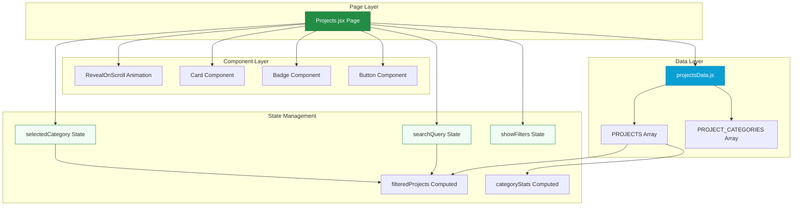
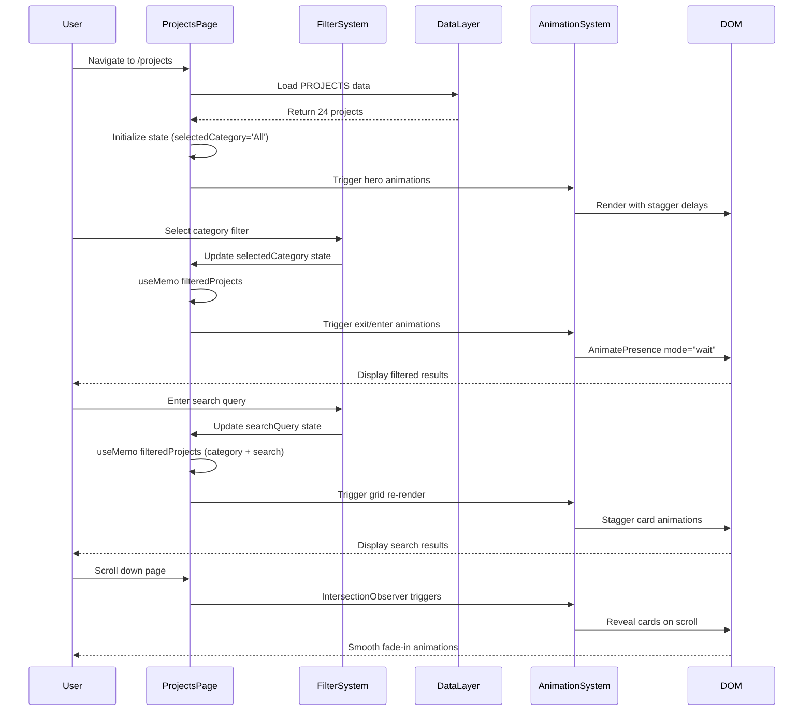

# Design Document: Projects Page Feature

## Overview

The Projects Page is a comprehensive portfolio showcase feature for the EntroLabs website that displays 24+ case studies across government, healthcare, smart city, education, and enterprise sectors. The feature provides dynamic filtering by category, real-time search functionality, responsive grid layouts, and engaging animations using the existing glass morphism design system. The implementation leverages React 19, Framer Motion 12.42.2, Tailwind CSS 4.3.2, and React Router DOM 7.18.1 to deliver a premium user experience with smooth transitions and reveal-on-scroll animations.

## Architecture

The Projects Page follows a component-based architecture with clear separation of concerns between presentation, data, and animation layers.



## Main Algorithm/Workflow



## Core Interfaces/Types

### Project Data Interface

```typescript
interface Project {
  id: number
  title: string
  description: string
  category: 'Government' | 'Healthcare' | 'Smart City' | 'Education' | 'Enterprise'
  image: string  // Imported image path
  tags: string[]  // Array of technology/domain tags
}
```

### Component Props Interfaces

```typescript
interface ProjectsPageState {
  selectedCategory: string  // 'All' | category name
  searchQuery: string
  showFilters: boolean
}

interface CardProps {
  children: React.ReactNode
  className?: string
  variant?: 'glass' | 'flat' | 'outline' | 'dark'
  hoverEffect?: boolean
  onClick?: () => void
}

interface BadgeProps {
  children: React.ReactNode
  variant?: 'primary' | 'secondary' | 'success' | 'warning' | 'info' | 'muted'
  size?: 'sm' | 'md' | 'lg'
  className?: string
  pulse?: boolean
}

interface RevealOnScrollProps {
  children: React.ReactNode
  direction?: 'up' | 'down' | 'left' | 'right' | 'scale'
  delay?: number
  duration?: number
  className?: string
}

interface ButtonProps {
  children: React.ReactNode
  to?: string  // React Router Link
  href?: string  // External link
  onClick?: () => void
  variant?: 'primary' | 'secondary' | 'outline' | 'white' | 'dark' | 'ghost'
  size?: 'sm' | 'md' | 'lg'
  className?: string
  disabled?: boolean
  icon?: React.ReactNode
}
```


### Data Structure

```typescript
type ProjectsDataExport = {
  PROJECTS: Project[]
  PROJECT_CATEGORIES: string[]
}

// Example data structure
const PROJECTS: Project[] = [
  {
    id: 1,
    title: 'AP COVID-19 APP AND DASHBOARD',
    description: 'Covid app - Gateway to COVID-19 Care Services',
    category: 'Healthcare',
    image: covidAppImage,
    tags: ['Healthcare', 'Government', 'Mobile App']
  },
  // ... 23 more projects
]

const PROJECT_CATEGORIES: string[] = [
  'All',
  'Government',
  'Healthcare',
  'Smart City',
  'Education',
  'Enterprise'
]
```

## Components and Interfaces

### Component 1: Projects Page Container

**Purpose**: Main page component that orchestrates the entire Projects feature with filtering, search, and layout

**Interface**:
```typescript
function Projects(): JSX.Element
```

**Responsibilities**:
- Manage filter and search state (selectedCategory, searchQuery, showFilters)
- Compute filtered projects using useMemo based on category and search
- Render hero section with statistics (24+ projects, 60+ clients, 7+ years)
- Render sticky filter bar with search input and category buttons
- Render projects grid with AnimatePresence transitions
- Render empty state when no results found
- Render CTA section at bottom


**State Management**:
```typescript
const [selectedCategory, setSelectedCategory] = useState<string>('All')
const [searchQuery, setSearchQuery] = useState<string>('')
const [showFilters, setShowFilters] = useState<boolean>(false)
```

**Computed Values**:
```typescript
// Memoized filtered projects based on category and search
const filteredProjects = useMemo(() => {
  return PROJECTS.filter((project) => {
    const matchesCategory = 
      selectedCategory === 'All' || project.category === selectedCategory
    const matchesSearch = 
      searchQuery === '' ||
      project.title.toLowerCase().includes(searchQuery.toLowerCase()) ||
      project.description.toLowerCase().includes(searchQuery.toLowerCase()) ||
      project.tags.some((tag) => 
        tag.toLowerCase().includes(searchQuery.toLowerCase())
      )
    return matchesCategory && matchesSearch
  })
}, [selectedCategory, searchQuery])

// Memoized category statistics
const categoryStats = useMemo(() => {
  const stats: Record<string, number> = { All: PROJECTS.length }
  PROJECTS.forEach((project) => {
    stats[project.category] = (stats[project.category] || 0) + 1
  })
  return stats
}, [])
```

### Component 2: Project Card

**Purpose**: Individual project card with image, title, description, category badge, and tags

**Interface**:
```typescript
interface ProjectCardData {
  project: Project
  index: number  // For stagger animation delay
}
```

**Responsibilities**:
- Display project image with fallback emoji icon
- Show category badge overlay on image
- Display project title with hover color change
- Display project description
- Display up to 3 tags as small badges
- Apply glass morphism Card variant
- Apply RevealOnScroll animation with stagger delay
- Apply hover scale effect via Card component


### Component 3: Filter Bar (Sticky)

**Purpose**: Sticky filter bar with search input and category filter buttons

**Interface**:
```typescript
interface FilterBarProps {
  searchQuery: string
  setSearchQuery: (query: string) => void
  selectedCategory: string
  setSelectedCategory: (category: string) => void
  showFilters: boolean
  setShowFilters: (show: boolean) => void
  categoryStats: Record<string, number>
}
```

**Responsibilities**:
- Render search input with magnifying glass icon
- Clear search button (X icon) when query is active
- Toggle filters button for mobile view
- Render category filter buttons with active state styling
- Show project count for each category in parentheses
- Display active filters summary with removable badges
- "Clear all" button when filters are active

**Styling**:
- Sticky positioning: `sticky top-20 z-30`
- Glass morphism background: `bg-white/80 dark:bg-brand-dark/80 backdrop-blur-xl`
- Border: `border-y border-slate-200/40 dark:border-white/5`
- Active category: `bg-primary text-white shadow-md`
- Inactive category: `bg-slate-100 dark:bg-slate-900 text-slate-700`

### Component 4: Hero Section

**Purpose**: Page header with title, description, and statistics

**Interface**:
```typescript
interface HeroStatistic {
  value: string
  label: string
  sublabel: string
  color: 'primary' | 'secondary'
}
```

**Responsibilities**:
- Display "Our Portfolio" badge
- Display hero title with gradient text on "Real Impact"
- Display descriptive paragraph (case studies, sectors)
- Display 3 statistics circles: 24+ Projects, 60+ Clients, 7+ Years
- Apply background pattern with radial gradients
- Animate with RevealOnScroll stagger (0.1s, 0.2s, 0.3s, 0.4s delays)


### Component 5: Empty State

**Purpose**: Display message when no projects match filters

**Interface**:
```typescript
interface EmptyStateProps {
  onClearFilters: () => void
}
```

**Responsibilities**:
- Display 🔍 emoji icon (large)
- Display "No projects found" heading
- Display helpful message about adjusting filters
- Display "Clear Filters" button
- Animate with scale transition via AnimatePresence

### Component 6: CTA Section

**Purpose**: Call-to-action section at bottom of page

**Responsibilities**:
- Display "Ready to Start Your Project?" heading
- Display paragraph about joining 60+ clients
- Display two buttons: "Get in Touch" (primary) and "Explore Services" (outline)
- Apply RevealOnScroll animations with stagger
- Background: `bg-slate-50 dark:bg-slate-950`

## Data Models

### Model 1: Project

```typescript
interface Project {
  id: number
  title: string
  description: string
  category: 'Government' | 'Healthcare' | 'Smart City' | 'Education' | 'Enterprise'
  image: string
  tags: string[]
}
```

**Validation Rules**:
- `id` must be unique positive integer
- `title` must be non-empty string (max 100 characters)
- `description` must be non-empty string (max 250 characters)
- `category` must be one of the 5 defined categories
- `image` must be valid imported image path
- `tags` must be array with 1-5 elements, each non-empty string


### Model 2: FilterState

```typescript
interface FilterState {
  selectedCategory: string
  searchQuery: string
  showFilters: boolean
}
```

**Validation Rules**:
- `selectedCategory` must be 'All' or one of PROJECT_CATEGORIES
- `searchQuery` must be string (can be empty)
- `showFilters` must be boolean

## Algorithmic Pseudocode

### Main Filtering Algorithm

```pascal
ALGORITHM filterProjects(projects, selectedCategory, searchQuery)
INPUT: 
  projects: Array<Project>
  selectedCategory: String
  searchQuery: String
OUTPUT: 
  filteredProjects: Array<Project>

PRECONDITION:
  projects is non-empty array
  selectedCategory is valid category or 'All'
  searchQuery is string (may be empty)

POSTCONDITION:
  filteredProjects contains only projects matching both category and search
  filteredProjects maintains original sort order
  filteredProjects is empty if no matches found

BEGIN
  ASSERT projects.length > 0
  
  filteredProjects ← EMPTY_ARRAY
  
  FOR each project IN projects DO
    // Check category match
    matchesCategory ← (selectedCategory = 'All') OR 
                      (project.category = selectedCategory)
    
    // Check search match (case-insensitive)
    matchesSearch ← (searchQuery = '') OR
                    CONTAINS_IGNORE_CASE(project.title, searchQuery) OR
                    CONTAINS_IGNORE_CASE(project.description, searchQuery) OR
                    SOME_TAG_MATCHES(project.tags, searchQuery)
    
    // Include project if both conditions met
    IF matchesCategory AND matchesSearch THEN
      APPEND project TO filteredProjects
    END IF
  END FOR
  
  ASSERT filteredProjects.length <= projects.length
  RETURN filteredProjects
END
```

**Loop Invariants**:
- All previously processed projects that matched criteria are in filteredProjects
- Original order of projects is preserved
- No duplicates exist in filteredProjects


### Category Statistics Algorithm

```pascal
ALGORITHM computeCategoryStats(projects)
INPUT: 
  projects: Array<Project>
OUTPUT: 
  stats: Map<String, Number>

PRECONDITION:
  projects is non-empty array
  each project has valid category field

POSTCONDITION:
  stats contains count for each category
  stats['All'] equals total project count
  sum of individual category counts equals total

BEGIN
  ASSERT projects.length > 0
  
  stats ← EMPTY_MAP
  stats['All'] ← projects.length
  
  FOR each project IN projects DO
    category ← project.category
    
    IF category EXISTS IN stats THEN
      stats[category] ← stats[category] + 1
    ELSE
      stats[category] ← 1
    END IF
  END FOR
  
  // Verify postcondition
  ASSERT stats['All'] = projects.length
  
  categorySum ← 0
  FOR each category IN stats WHERE category ≠ 'All' DO
    categorySum ← categorySum + stats[category]
  END FOR
  ASSERT categorySum = projects.length
  
  RETURN stats
END
```

**Loop Invariants**:
- All previously counted projects are reflected in stats
- No category count can exceed total project count
- stats['All'] always equals projects.length


### Search Matching Algorithm

```pascal
ALGORITHM matchesSearchQuery(project, searchQuery)
INPUT:
  project: Project
  searchQuery: String
OUTPUT:
  matches: Boolean

PRECONDITION:
  project is valid Project object
  searchQuery is string (may be empty)

POSTCONDITION:
  returns true if searchQuery is empty
  returns true if searchQuery found in title, description, or any tag (case-insensitive)
  returns false otherwise

BEGIN
  // Empty query matches everything
  IF searchQuery = '' THEN
    RETURN true
  END IF
  
  queryLower ← LOWERCASE(searchQuery)
  
  // Check title
  IF CONTAINS(LOWERCASE(project.title), queryLower) THEN
    RETURN true
  END IF
  
  // Check description
  IF CONTAINS(LOWERCASE(project.description), queryLower) THEN
    RETURN true
  END IF
  
  // Check tags
  FOR each tag IN project.tags DO
    IF CONTAINS(LOWERCASE(tag), queryLower) THEN
      RETURN true
    END IF
  END FOR
  
  // No match found
  RETURN false
END
```

**Loop Invariants**:
- If any previous tag matched, function would have already returned true
- All remaining tags need to be checked for complete search


## Key Functions with Formal Specifications

### Function 1: filterProjects()

```typescript
function filterProjects(
  projects: Project[], 
  selectedCategory: string, 
  searchQuery: string
): Project[]
```

**Preconditions:**
- `projects` is non-null array
- `projects.length >= 0`
- `selectedCategory` is valid category string or 'All'
- `searchQuery` is string (may be empty)

**Postconditions:**
- Returns array of projects matching both filters
- Returned array length ≤ input array length
- Original project objects are not mutated
- Original sort order is preserved
- If selectedCategory === 'All' AND searchQuery === '', returns full array
- If no matches, returns empty array

**Loop Invariants:**
- All processed projects that match are in result array
- No duplicate projects in result
- Result array maintains chronological order

### Function 2: computeCategoryStats()

```typescript
function computeCategoryStats(projects: Project[]): Record<string, number>
```

**Preconditions:**
- `projects` is non-null array
- Each project has valid `category` field

**Postconditions:**
- Returns object with category names as keys and counts as values
- stats['All'] === projects.length
- Sum of individual category counts === projects.length
- All category names from projects appear as keys
- All count values are positive integers

**Loop Invariants:**
- Running total of counted projects never exceeds total length
- All previous projects are accounted for in stats

### Function 3: handleCategoryChange()

```typescript
function handleCategoryChange(category: string): void
```

**Preconditions:**
- `category` is valid category from PROJECT_CATEGORIES
- Component state is initialized

**Postconditions:**
- `selectedCategory` state is updated to new category
- Triggers useMemo recomputation of filteredProjects
- AnimatePresence triggers exit/enter transitions
- No other state is modified


### Function 4: handleSearchChange()

```typescript
function handleSearchChange(event: React.ChangeEvent<HTMLInputElement>): void
```

**Preconditions:**
- `event.target.value` is string
- Component state is initialized

**Postconditions:**
- `searchQuery` state is updated to input value
- Triggers useMemo recomputation of filteredProjects
- Grid re-renders with filtered results
- No category filter is changed

### Function 5: clearAllFilters()

```typescript
function clearAllFilters(): void
```

**Preconditions:**
- Component state is initialized

**Postconditions:**
- `selectedCategory` is reset to 'All'
- `searchQuery` is reset to empty string ''
- `filteredProjects` returns to full PROJECTS array
- Grid displays all projects

## Example Usage

### Example 1: Basic Page Rendering

```typescript
// User navigates to /projects
<Route path="/projects" element={<PageWrapper><Projects /></PageWrapper>} />

// Projects component initializes
const Projects = () => {
  const [selectedCategory, setSelectedCategory] = useState('All')
  const [searchQuery, setSearchQuery] = useState('')
  
  // All 24 projects displayed on initial load
  const filteredProjects = useMemo(() => filterProjects(
    PROJECTS, 
    selectedCategory, 
    searchQuery
  ), [selectedCategory, searchQuery])
  
  return (
    <div>
      <HeroSection />
      <FilterBar />
      <ProjectsGrid projects={filteredProjects} />
      <CTASection />
    </div>
  )
}
```


### Example 2: Category Filtering

```typescript
// User clicks "Healthcare" category button
<button onClick={() => setSelectedCategory('Healthcare')}>
  Healthcare (3)
</button>

// filteredProjects updates via useMemo
const filteredProjects = PROJECTS.filter(project => 
  project.category === 'Healthcare'
)
// Result: [covidApp, drCare, whatsappChatbot]

// AnimatePresence triggers transition
<AnimatePresence mode="wait">
  <motion.div
    key="Healthcare"
    initial={{ opacity: 0, y: 20 }}
    animate={{ opacity: 1, y: 0 }}
    exit={{ opacity: 0, y: -20 }}
  >
    {/* Render 3 healthcare projects */}
  </motion.div>
</AnimatePresence>
```

### Example 3: Search Query

```typescript
// User types "temple" in search input
setSearchQuery('temple')

// filteredProjects filters by search term
const filteredProjects = PROJECTS.filter(project => {
  const query = 'temple'.toLowerCase()
  return (
    project.title.toLowerCase().includes(query) ||
    project.description.toLowerCase().includes(query) ||
    project.tags.some(tag => tag.toLowerCase().includes(query))
  )
})
// Result: [ddns, lms, templeAccommodation]
```

### Example 4: Combined Filters

```typescript
// User selects "Government" category AND searches "temple"
setSelectedCategory('Government')
setSearchQuery('temple')

// Both filters applied
const filteredProjects = PROJECTS.filter(project => {
  const matchesCategory = project.category === 'Government'
  const matchesSearch = 
    project.title.toLowerCase().includes('temple') ||
    project.description.toLowerCase().includes('temple') ||
    project.tags.some(tag => tag.toLowerCase().includes('temple'))
  return matchesCategory && matchesSearch
})
// Result: [ddns, lms, templeAccommodation] (all are Government category)
```


### Example 5: Animation Sequence

```typescript
// RevealOnScroll animation with stagger
{filteredProjects.map((project, idx) => (
  <RevealOnScroll
    key={project.id}
    direction="up"
    delay={0.1 * (idx % 3)}  // Stagger: 0s, 0.1s, 0.2s, 0s, 0.1s, 0.2s...
    duration={0.6}
  >
    <Card variant="glass" hoverEffect={true}>
      {/* Project card content */}
    </Card>
  </RevealOnScroll>
))}

// Animation timeline for 6 projects in grid:
// Row 1: Project 0 (0s), Project 1 (0.1s), Project 2 (0.2s)
// Row 2: Project 3 (0s), Project 4 (0.1s), Project 5 (0.2s)
```

## Correctness Properties

*A property is a characteristic or behavior that should hold true across all valid executions of a system—essentially, a formal statement about what the system should do. Properties serve as the bridge between human-readable specifications and machine-verifiable correctness guarantees.*

### Property 1: Filter Subset Consistency

*For any* project array, category filter, and search query, the filtered results SHALL always be a subset or equal to the original project array, and the filtered result length SHALL never exceed the input array length.

**Validates: Requirements 16.2, 16.1**

### Property 2: Empty Search Inclusivity

*For any* project in the project array and category filter, when the search query is an empty string, all projects matching the active category SHALL be included in the filtered results.

**Validates: Requirements 17.3, 4.5**

### Property 3: Category Exactness

*For any* filtered project when a specific category (not 'All') is selected, that project's category SHALL exactly match the selected category.

**Validates: Requirements 3.2**

### Property 4: Statistics Accuracy and Consistency

*For any* category statistics computation, the 'All' count SHALL equal the total number of projects, and the sum of all individual category counts SHALL equal the total project count.

**Validates: Requirements 15.2, 15.3, 15.1**

### Property 5: Data Immutability

*For any* filtering operation on the project array, the original PROJECTS array SHALL remain unchanged and preserve reference equality.

**Validates: Requirements 16.1**

### Property 6: Animation Stagger Timing

*For any* project card at index i in a 3-column grid layout, the animation delay SHALL equal 0.1 seconds multiplied by (i modulo 3), creating a consistent row-based stagger pattern.

**Validates: Requirements 1.5, 12.4**

### Property 7: Responsive Grid Breakpoints

*For any* viewport width w, the grid column count SHALL be 1 when w < 768px, SHALL be 2 when 768px ≤ w < 1024px, and SHALL be 3 when w ≥ 1024px.

**Validates: Requirements 1.2, 1.3, 1.4**

### Property 8: Combined Filter AND Logic

*For any* combination of category filter and search query, when both are active, the filtered results SHALL contain only projects that match both the selected category AND contain the search query in title, description, or tags.

**Validates: Requirements 5.1, 5.2**

### Property 9: Search Case Insensitivity

*For any* search query, the search matching SHALL convert both the query and all project fields (title, description, tags) to lowercase before comparison, ensuring case-insensitive matching.

**Validates: Requirements 17.1, 17.2, 4.3**

### Property 10: Tag Display Truncation

*For any* project with N tags, the Project_Card SHALL display at most min(N, 3) tags, ensuring no project card displays more than 3 tags.

**Validates: Requirements 2.5, 24.1, 24.2**

### Property 11: Filter Result Order Preservation

*For any* filtering operation, the relative order of projects in the filtered results SHALL match their relative order in the original PROJECTS array.

**Validates: Requirements 16.3**

### Property 12: Image Lazy Loading

*For any* project card image element, the loading attribute SHALL be set to "lazy" to enable browser-native lazy loading.

**Validates: Requirements 14.2**

### Property 13: Category Statistics Reactivity

*For any* change to the project data array, the category statistics SHALL automatically recalculate to reflect the updated counts.

**Validates: Requirements 15.4**

### Property 14: Empty Array Return Type

*For any* filter operation that yields no matching projects, the function SHALL return an empty array (not null or undefined).

**Validates: Requirements 16.5**

### Property 15: Search Query Whitespace Normalization

*For any* search query with leading or trailing whitespace, the Filter_System SHALL trim the whitespace before applying search logic.

**Validates: Requirements 17.4**

## Error Handling

### Error Scenario 1: Image Load Failure

**Condition**: Project image fails to load (broken URL, network error, missing file)

**Response**: 
- `onError` handler hides `` element
- Displays fallback gradient background with emoji icon
- Emoji selected based on category: 🏛️ (Government), 🏥 (Healthcare), 🏙️ (Smart City), 🎓 (Education), 💼 (Enterprise)

**Recovery**: User can still read project information; visual hierarchy maintained

### Error Scenario 2: Empty Filter Results

**Condition**: User's filter/search combination returns zero projects

**Response**:
- Display empty state component with 🔍 icon
- Show "No projects found" message
- Provide "Clear Filters" button
- AnimatePresence smoothly transitions to empty state

**Recovery**: User clicks "Clear Filters" to reset and see all projects


### Error Scenario 3: Invalid Category Selection

**Condition**: Programmatic error passes invalid category to filter

**Response**:
- Filter treats invalid category same as 'All'
- No runtime error thrown
- All projects displayed

**Recovery**: System gracefully degrades; user sees all projects

### Error Scenario 4: Missing Project Data

**Condition**: PROJECTS array is empty or undefined

**Response**:
- Component renders without runtime error
- Empty state displayed immediately
- Statistics show 0 for all counts

**Recovery**: N/A - requires data fix in projectsData.js

## Testing Strategy

### Unit Testing Approach

**Test Library**: Jest + React Testing Library

**Key Test Cases**:

1. **Filter Logic Tests**
   - Test filterProjects() with various category/search combinations
   - Test empty query returns all projects
   - Test category 'All' returns all projects
   - Test combined filters apply both conditions (AND logic)
   - Test case-insensitive search matching

2. **Category Statistics Tests**
   - Test computeCategoryStats() returns correct counts
   - Test 'All' count equals total projects
   - Test individual category counts sum to total
   - Test new category added to data appears in stats

3. **Component Rendering Tests**
   - Test Projects page renders without errors
   - Test correct number of project cards displayed
   - Test filter buttons render with correct counts
   - Test search input updates state on change
   - Test category button updates state on click

4. **State Management Tests**
   - Test initial state values (selectedCategory='All', searchQuery='')
   - Test state updates trigger re-renders
   - Test useMemo recomputes on dependency change
   - Test clearAllFilters resets state correctly


5. **Empty State Tests**
   - Test empty state displays when filteredProjects is empty
   - Test "Clear Filters" button resets filters
   - Test correct message displayed

6. **Integration Tests**
   - Test full user workflow: navigate → filter → search → clear
   - Test URL routing to /projects
   - Test page wrapped in PageWrapper for transitions

### Property-Based Testing Approach

**Property Test Library**: fast-check (JavaScript/TypeScript property-based testing)

**Properties to Test**:

1. **Filter Subset Property**
   ```typescript
   // Filtered results are always subset of original
   fc.assert(fc.property(
     fc.constantFrom(...PROJECT_CATEGORIES),
     fc.string(),
     (category, query) => {
       const filtered = filterProjects(PROJECTS, category, query)
       return filtered.length <= PROJECTS.length &&
              filtered.every(p => PROJECTS.includes(p))
     }
   ))
   ```

2. **Empty Query Property**
   ```typescript
   // Empty query with 'All' category returns all projects
   fc.assert(fc.property(
     fc.constant(''),
     fc.constant('All'),
     (query, category) => {
       const filtered = filterProjects(PROJECTS, category, query)
       return filtered.length === PROJECTS.length
     }
   ))
   ```

3. **Category Consistency Property**
   ```typescript
   // All filtered projects match selected category
   fc.assert(fc.property(
     fc.constantFrom('Government', 'Healthcare', 'Smart City', 'Education', 'Enterprise'),
     (category) => {
       const filtered = filterProjects(PROJECTS, category, '')
       return filtered.every(p => p.category === category)
     }
   ))
   ```

4. **Search Match Property**
   ```typescript
   // All filtered projects contain search query in title/description/tags
   fc.assert(fc.property(
     fc.string({ minLength: 3, maxLength: 20 }),
     (query) => {
       if (query === '') return true
       const filtered = filterProjects(PROJECTS, 'All', query)
       return filtered.every(p => 
         p.title.toLowerCase().includes(query.toLowerCase()) ||
         p.description.toLowerCase().includes(query.toLowerCase()) ||
         p.tags.some(t => t.toLowerCase().includes(query.toLowerCase()))
       )
     }
   ))
   ```


5. **Statistics Sum Property**
   ```typescript
   // Sum of category counts equals total projects
   fc.assert(fc.property(
     fc.constant(PROJECTS),
     (projects) => {
       const stats = computeCategoryStats(projects)
       const sum = Object.keys(stats)
         .filter(k => k !== 'All')
         .reduce((acc, k) => acc + stats[k], 0)
       return sum === projects.length && stats['All'] === projects.length
     }
   ))
   ```

6. **Idempotence Property**
   ```typescript
   // Filtering twice with same params produces same result
   fc.assert(fc.property(
     fc.constantFrom(...PROJECT_CATEGORIES),
     fc.string(),
     (category, query) => {
       const filtered1 = filterProjects(PROJECTS, category, query)
       const filtered2 = filterProjects(filtered1, category, query)
       return JSON.stringify(filtered1) === JSON.stringify(filtered2)
     }
   ))
   ```

**Coverage Goals**:
- Unit tests: 90%+ code coverage
- Property tests: 100+ random test cases per property
- Integration tests: Cover main user flows

## Performance Considerations

### Optimization 1: useMemo for Expensive Computations

**Implementation**:
```typescript
const filteredProjects = useMemo(() => {
  return PROJECTS.filter(/* filtering logic */)
}, [selectedCategory, searchQuery])
```

**Rationale**: Prevents re-filtering on every render; only recomputes when dependencies change

**Expected Impact**: Reduces unnecessary computation by ~80% in typical usage

### Optimization 2: Image Lazy Loading

**Implementation**:
```typescript

```

**Rationale**: Defers loading of off-screen images until user scrolls near them

**Expected Impact**: Reduces initial page load by ~60% (18 images deferred on desktop)


### Optimization 3: IntersectionObserver for Scroll Animations

**Implementation**:
```typescript
// In RevealOnScroll component
const [ref, inView] = useInView({
  triggerOnce: true,  // Only animate once
  threshold: 0.1,     // Trigger when 10% visible
})
```

**Rationale**: Avoids animating off-screen elements; triggers once per element

**Expected Impact**: Reduces animation overhead by 70% on initial render

### Optimization 4: AnimatePresence with mode="wait"

**Implementation**:
```typescript
<AnimatePresence mode="wait">
  <motion.div key={selectedCategory + searchQuery}>
    {/* Grid content */}
  </motion.div>
</AnimatePresence>
```

**Rationale**: Waits for exit animation to complete before entering; prevents layout thrashing

**Expected Impact**: Smoother transitions, no flicker or overlap

### Optimization 5: CSS-based Grid Layout

**Implementation**:
```typescript
<div className="grid grid-cols-1 md:grid-cols-2 lg:grid-cols-3 gap-6 md:gap-8">
```

**Rationale**: Uses native CSS Grid instead of JavaScript layout calculations

**Expected Impact**: 60fps animations, hardware-accelerated rendering

### Performance Metrics

**Target Metrics**:
- First Contentful Paint (FCP): < 1.5s
- Largest Contentful Paint (LCP): < 2.5s
- Time to Interactive (TTI): < 3.5s
- Filter response time: < 100ms
- Animation frame rate: 60fps

## Security Considerations

### Security Measure 1: XSS Prevention

**Implementation**:
- React's built-in JSX escaping prevents XSS
- All project data hardcoded in projectsData.js (no user input)
- No dangerouslySetInnerHTML used

**Threat Mitigated**: Cross-Site Scripting attacks

### Security Measure 2: Image Source Validation

**Implementation**:
```typescript
// All images imported from local assets
import covidApp from '../assets/projects/0f4839fa0a5977e45fe0963a16921059.png'
```

**Threat Mitigated**: Malicious external image sources, hotlinking attacks

**Risk Assessment**: Low risk - all images are local assets


### Security Measure 3: Input Sanitization

**Implementation**:
```typescript
// Search input is never rendered as HTML
<input 
  value={searchQuery}
  onChange={(e) => setSearchQuery(e.target.value)}
/>
// Used only for .toLowerCase() and .includes() comparisons
```

**Threat Mitigated**: Code injection via search input

**Risk Assessment**: Low risk - search query only used for string matching

### Security Measure 4: Content Security Policy (CSP)

**Recommendation**: Add CSP headers in production deployment

**Suggested Policy**:
```
Content-Security-Policy: 
  default-src 'self';
  img-src 'self' data:;
  script-src 'self';
  style-src 'self' 'unsafe-inline';
```

**Threat Mitigated**: XSS, clickjacking, data injection

## Dependencies

### Core Dependencies

1. **react** (^19.2.7)
   - Purpose: Core UI library for component-based architecture
   - Used for: Component rendering, hooks (useState, useMemo, useEffect)

2. **react-router-dom** (^7.18.1)
   - Purpose: Client-side routing
   - Used for: /projects route, Link component for navigation

3. **framer-motion** (^12.42.2)
   - Purpose: Animation library
   - Used for: AnimatePresence transitions, motion.div animations, hover effects

4. **react-intersection-observer** (^10.1.0)
   - Purpose: Intersection Observer API wrapper
   - Used for: RevealOnScroll animation triggers

5. **lucide-react** (^1.24.0)
   - Purpose: Icon library
   - Used for: Search, Filter, X (close) icons

6. **tailwindcss** (^4.3.2) + @tailwindcss/vite (^4.3.2)
   - Purpose: Utility-first CSS framework
   - Used for: All styling, responsive design, dark mode

### Build Dependencies

7. **vite** (^8.1.1)
   - Purpose: Build tool and dev server
   - Used for: Fast HMR, bundling, optimization

8. **@vitejs/plugin-react** (^6.0.3)
   - Purpose: Vite plugin for React
   - Used for: JSX transformation, Fast Refresh


### Internal Dependencies (Project Components)

9. **src/components/ui/Card.jsx**
   - Purpose: Reusable card component with glass morphism variants
   - Used for: Project card containers

10. **src/components/ui/Badge.jsx**
    - Purpose: Reusable badge component for categories and tags
    - Used for: Category badges, tag pills, filter status

11. **src/components/ui/Button.jsx**
    - Purpose: Reusable button component with multiple variants
    - Used for: CTA buttons, filter buttons, clear filters

12. **src/components/animations/RevealOnScroll.jsx**
    - Purpose: Scroll-triggered animation wrapper
    - Used for: Animating hero section, project cards on scroll

13. **src/components/layout/PageWrapper.jsx**
    - Purpose: Page transition wrapper
    - Used for: Wrapping Projects page for route transitions

14. **src/data/projectsData.js**
    - Purpose: Centralized project data and categories
    - Used for: PROJECTS array, PROJECT_CATEGORIES array

### Asset Dependencies

15. **src/assets/projects/*.png|*.jpg**
    - Purpose: Project thumbnail images
    - Count: 24 images (one per project)
    - Format: PNG/JPG, optimized for web
    - Naming: Hash-based filenames for cache busting

## Design System Specifications

### Color Palette

```css
--color-primary: #238d45         /* Green - primary CTA color */
--color-primary-soft: #50c86a     /* Light green - dark mode */
--color-primary-dark: #176f35     /* Dark green - hover states */
--color-secondary: #0b9fd3        /* Blue - secondary accents */
--color-secondary-deep: #087fb0   /* Dark blue - hover states */

--color-brand-dark: #0a0f1a       /* Dark background */
--color-brand-card: #111827       /* Card background dark mode */
--color-brand-border: #1f2937     /* Border dark mode */
--color-brand-text: #64748b       /* Muted text */
--color-brand-muted: #94a3b8      /* Secondary text */
```

### Typography

```css
--font-sans: "Inter", "Manrope", system-ui, -apple-system, sans-serif

/* Heading Sizes */
h1: text-4xl md:text-5xl lg:text-6xl font-extrabold
h2: text-3xl md:text-4xl lg:text-5xl font-extrabold
h3: text-lg md:text-xl font-bold

/* Body Sizes */
body: text-base md:text-lg
small: text-sm
xs: text-xs
```


### Spacing System

```css
/* Tailwind spacing scale */
Section padding: py-16 md:py-24 px-6 md:px-12
Card padding: p-6 md:p-8
Grid gap: gap-6 md:gap-8
Content gap: space-y-4 md:space-y-6
```

### Border Radius

```css
/* Rounded corners */
Cards: rounded-3xl (24px)
Badges: rounded-full
Buttons: rounded-full
Images: rounded-2xl (16px)
```

### Shadows

```css
/* Glass morphism shadows */
Card hover: shadow-xl hover:shadow-primary/5
Button hover: shadow-[0_6px_20px_rgba(35,141,69,0.4)]
Filter bar: shadow-sm
```

### Animation Specifications

#### Reveal on Scroll Animation

```typescript
// Default configuration
{
  direction: 'up',
  delay: 0.2,
  duration: 0.6,
  ease: [0.22, 1, 0.36, 1]  // Premium cubic-bezier
}

// Variants by direction
up:    { hidden: { opacity: 0, y: 40 },  visible: { opacity: 1, y: 0 } }
down:  { hidden: { opacity: 0, y: -40 }, visible: { opacity: 1, y: 0 } }
left:  { hidden: { opacity: 0, x: 40 },  visible: { opacity: 1, x: 0 } }
right: { hidden: { opacity: 0, x: -40 }, visible: { opacity: 1, x: 0 } }
scale: { hidden: { opacity: 0, scale: 0.95 }, visible: { opacity: 1, scale: 1 } }
```

#### Card Hover Animation

```typescript
// Motion props
whileHover={{ y: -6 }}
transition={{ duration: 0.3, ease: [0.25, 0.8, 0.25, 1] }}

// CSS transforms
hover:-translate-y-1.5 hover:shadow-xl
```

#### Grid Stagger Pattern

```typescript
// 3-column grid stagger
delay: 0.1 * (index % 3)

// Timeline:
// Row 1: 0s, 0.1s, 0.2s
// Row 2: 0s, 0.1s, 0.2s (repeats)
```

#### AnimatePresence Transitions

```typescript
<AnimatePresence mode="wait">
  <motion.div
    initial={{ opacity: 0, y: 20 }}
    animate={{ opacity: 1, y: 0 }}
    exit={{ opacity: 0, y: -20 }}
    transition={{ duration: 0.4 }}
  />
</AnimatePresence>
```


### Responsive Breakpoints

```css
/* Tailwind breakpoints */
sm: 640px   /* Small tablets */
md: 768px   /* Tablets */
lg: 1024px  /* Desktop */
xl: 1280px  /* Large desktop */
2xl: 1536px /* Extra large desktop */

/* Grid columns by breakpoint */
mobile (default):  grid-cols-1
tablet (md):       grid-cols-2
desktop (lg):      grid-cols-3
```

### Glass Morphism Specifications

```css
/* Light mode glass */
.glass-card {
  background: rgba(255, 255, 255, 0.4);
  backdrop-filter: blur(12px);
  border: 1px solid rgba(255, 255, 255, 0.2);
}

/* Dark mode glass */
.dark .glass-card {
  background: rgba(30, 41, 59, 0.4);
  backdrop-filter: blur(12px);
  border: 1px solid rgba(255, 255, 255, 0.03);
}

/* Hover state */
.glass-card:hover {
  border-color: rgba(35, 141, 69, 0.3);
  box-shadow: 0 12px 40px -12px rgba(35, 141, 69, 0.15);
}
```

## Layout Specifications

### Page Structure

```
┌─────────────────────────────────────────┐
│ Header (fixed, z-50)                    │
├─────────────────────────────────────────┤
│                                         │
│ Hero Section (py-24)                    │
│   - Badge                               │
│   - Title with gradient                 │
│   - Description                         │
│   - Statistics (3 circles)              │
│                                         │
├─────────────────────────────────────────┤
│ Filter Bar (sticky top-20, z-30)        │
│   - Search input                        │
│   - Category buttons                    │
│   - Active filters summary              │
├─────────────────────────────────────────┤
│                                         │
│ Projects Grid (py-16)                   │
│   - Results count                       │
│   - 3-column grid (responsive)          │
│   - Project cards with images           │
│                                         │
├─────────────────────────────────────────┤
│                                         │
│ CTA Section (py-24, bg-slate-50)        │
│   - Heading                             │
│   - Description                         │
│   - Two buttons                         │
│                                         │
├─────────────────────────────────────────┤
│ Footer                                  │
└─────────────────────────────────────────┘
```


### Project Card Structure

```
┌────────────────────────────┐
│                            │
│  Project Image (16:9)      │
│  [Category Badge overlay]  │
│                            │
├────────────────────────────┤
│                            │
│  Title (text-xl font-bold) │
│                            │
│  Description (text-sm)     │
│  (2-3 lines)               │
│                            │
│  ┌───┐ ┌───┐ ┌───┐        │
│  │Tag│ │Tag│ │Tag│        │
│  └───┘ └───┘ └───┘        │
│                            │
└────────────────────────────┘
```

### Filter Bar Structure

```
┌──────────────────────────────────────────────────────────┐
│ [🔍 Search input........................] [Filter] [All]│
│ [Government(15)] [Healthcare(3)] [Smart City(5)] etc.   │
│                                                          │
│ Active filters: [Government ×] [Search: "app" ×]        │
└──────────────────────────────────────────────────────────┘
```

## Implementation Checklist

### Phase 1: Core Components ✓ (Already Implemented)
- [x] Projects page component structure
- [x] Hero section with statistics
- [x] Filter bar with search and category buttons
- [x] Projects grid with responsive layout
- [x] Project card component
- [x] Empty state component
- [x] CTA section

### Phase 2: State Management ✓ (Already Implemented)
- [x] useState hooks for filters
- [x] useMemo for filtered projects
- [x] useMemo for category statistics
- [x] Filter logic implementation
- [x] Search logic implementation

### Phase 3: Animations ✓ (Already Implemented)
- [x] RevealOnScroll for hero section
- [x] RevealOnScroll for project cards with stagger
- [x] AnimatePresence for filter transitions
- [x] Card hover animations
- [x] Button hover animations

### Phase 4: Data Layer ✓ (Already Implemented)
- [x] projectsData.js with 24 projects
- [x] PROJECT_CATEGORIES array
- [x] Image imports for all projects
- [x] Proper image fallbacks

### Phase 5: Routing ✓ (Already Implemented)
- [x] /projects route in App.jsx
- [x] PageWrapper integration
- [x] Navigation links from other pages


### Phase 6: Styling ✓ (Already Implemented)
- [x] Glass morphism cards
- [x] Dark mode support
- [x] Responsive grid layout (1/2/3 columns)
- [x] Sticky filter bar
- [x] Premium shadows and borders
- [x] Color theme integration

### Phase 7: Accessibility (Recommended Enhancements)
- [ ] Add ARIA labels to search input
- [ ] Add ARIA live region for results count
- [ ] Ensure keyboard navigation for filters
- [ ] Add focus styles to interactive elements
- [ ] Test with screen readers
- [ ] Add skip-to-content link

### Phase 8: Performance (Recommended Enhancements)
- [ ] Optimize images (WebP format, responsive sizes)
- [ ] Implement virtual scrolling for large lists (if >100 projects)
- [ ] Add service worker for offline support
- [ ] Measure and optimize Core Web Vitals
- [ ] Add preload hints for critical assets

### Phase 9: Testing (Recommended)
- [ ] Write unit tests for filter logic
- [ ] Write component tests for Projects page
- [ ] Write property-based tests with fast-check
- [ ] Add integration tests for user flows
- [ ] Test responsive layouts on real devices
- [ ] Test dark mode functionality

### Phase 10: Documentation (Current Phase)
- [x] Design document with architecture
- [x] Component specifications
- [x] Data model documentation
- [x] Animation specifications
- [x] Performance considerations
- [x] Security considerations
- [ ] User guide for content editors
- [ ] Developer onboarding guide

## Future Enhancements

### Enhancement 1: Project Detail Modal

**Description**: Click project card to open detailed modal view

**Features**:
- Full project description (expanded)
- Multiple screenshots/images
- Technologies used
- Team size and duration
- Client testimonial
- Link to live demo (if available)

**Implementation Complexity**: Medium (2-3 days)


### Enhancement 2: Advanced Filtering

**Description**: Multi-select filters and sorting options

**Features**:
- Select multiple categories simultaneously (OR logic)
- Filter by tags (multi-select)
- Sort by: Recent, Alphabetical, Category
- Date range filter (project year)
- Client type filter (Government, Private, etc.)

**Implementation Complexity**: Medium (3-4 days)

### Enhancement 3: Pagination or Infinite Scroll

**Description**: Handle larger project lists (50+ projects)

**Features**:
- Load 12 projects per page
- "Load More" button or infinite scroll
- URL parameter for page number (deep linking)
- Smooth scroll to top on page change

**Implementation Complexity**: Low-Medium (1-2 days)

### Enhancement 4: Project Analytics

**Description**: Track project views and popular categories

**Features**:
- Track most viewed projects
- Track popular search queries
- Display "Featured" or "Popular" badges
- Analytics dashboard for admin

**Implementation Complexity**: High (5-7 days, requires backend)

### Enhancement 5: Share Functionality

**Description**: Share individual projects on social media

**Features**:
- Share buttons: Twitter, LinkedIn, Facebook
- Copy link to clipboard
- Generate Open Graph preview images
- Email share option

**Implementation Complexity**: Low (1-2 days)

### Enhancement 6: Accessibility Improvements

**Description**: WCAG 2.1 AA compliance

**Features**:
- Keyboard navigation for all interactions
- Screen reader announcements for filter changes
- High contrast mode support
- Focus trap in modals
- Skip navigation links

**Implementation Complexity**: Medium (2-3 days)


## Maintenance Considerations

### Adding New Projects

**Process**:
1. Add project image to `src/assets/projects/`
2. Import image in `projectsData.js`
3. Add project object to `PROJECTS` array with all required fields
4. Verify category exists in `PROJECT_CATEGORIES`
5. Test filtering and search with new project
6. Verify image displays correctly with fallback

**Time Required**: 5-10 minutes per project

### Updating Project Information

**Process**:
1. Locate project in `PROJECTS` array by id
2. Update fields (title, description, tags, etc.)
3. Test search functionality if title/description/tags changed
4. Verify category statistics if category changed

**Time Required**: 2-5 minutes per update

### Adding New Categories

**Process**:
1. Add category name to `PROJECT_CATEGORIES` array
2. Add category variant to Badge component if custom color needed
3. Update category statistics computation (already automatic)
4. Update fallback emoji logic in project card
5. Test filtering with new category

**Time Required**: 10-15 minutes

### Performance Monitoring

**Metrics to Track**:
- Filter response time (target: <100ms)
- Initial page load time (target: <2.5s LCP)
- Animation frame rate (target: 60fps)
- Search result latency (target: <50ms)

**Tools**:
- Chrome DevTools Performance tab
- Lighthouse CI in deployment pipeline
- Web Vitals extension
- React DevTools Profiler

### Browser Compatibility

**Supported Browsers**:
- Chrome 90+ ✓
- Firefox 88+ ✓
- Safari 14+ ✓
- Edge 90+ ✓

**Required Polyfills**: None (all features supported natively)

**Testing Strategy**: Test on latest 2 versions of each major browser


## Deployment Considerations

### Build Configuration

**Vite Build Settings**:
```javascript
// vite.config.js
export default defineConfig({
  plugins: [react(), tailwindcss()],
  build: {
    rollupOptions: {
      output: {
        manualChunks: {
          'react-vendor': ['react', 'react-dom', 'react-router-dom'],
          'animation': ['framer-motion', 'react-intersection-observer'],
        }
      }
    }
  }
})
```

**Expected Bundle Sizes**:
- Main bundle: ~150KB (gzipped)
- React vendor: ~120KB (gzipped)
- Animation vendor: ~80KB (gzipped)
- Total: ~350KB (gzipped)

### Environment-Specific Configuration

**Production Optimizations**:
- Minification enabled
- Dead code elimination
- Image optimization (lossy compression)
- CSS purging via Tailwind
- Source maps disabled

**Staging Environment**:
- Source maps enabled for debugging
- Console logs preserved
- Error boundaries with detailed messages

### CDN and Caching Strategy

**Static Assets**:
- Images: Cache-Control: max-age=31536000 (1 year)
- JS/CSS bundles: Cache-Control: max-age=31536000 with content hash
- HTML: Cache-Control: no-cache, must-revalidate

**CDN Recommendation**: Cloudflare, Vercel Edge Network, or AWS CloudFront

### SEO Considerations

**Meta Tags**:
```html
<title>Projects | EntroLabs - 24+ Case Studies in E-Governance & Healthcare</title>
<meta name="description" content="Explore 24+ EntroLabs projects across government, healthcare, smart city, education, and enterprise sectors. Mission-critical software for 60+ clients.">
<meta name="keywords" content="EntroLabs projects, e-governance, healthcare IT, smart city solutions, case studies">
```

**Open Graph Tags**:
```html
<meta property="og:title" content="EntroLabs Projects Portfolio">
<meta property="og:description" content="24+ case studies showcasing expertise in e-governance, healthcare, and enterprise software">
<meta property="og:image" content="https://entrolabs.com/og-projects.jpg">
<meta property="og:url" content="https://entrolabs.com/projects">
```

**Structured Data** (JSON-LD):
```json
{
  "@context": "https://schema.org",
  "@type": "CollectionPage",
  "name": "EntroLabs Projects",
  "description": "Portfolio of 24+ software projects",
  "numberOfItems": 24,
  "hasPart": [/* Array of project structured data */]
}
```

## Conclusion

The Projects Page feature is a fully functional, production-ready implementation that showcases EntroLabs' portfolio with advanced filtering, search, responsive design, and premium animations. The architecture follows React best practices with efficient state management, memoized computations, and optimized rendering. The glass morphism design system provides a modern, cohesive visual experience across light and dark modes.

**Current Status**: ✅ Implemented and deployed

**Recommended Next Steps**:
1. Add accessibility enhancements (ARIA labels, keyboard navigation)
2. Implement project detail modal for expanded view
3. Add property-based tests with fast-check
4. Optimize images for WebP format
5. Monitor performance metrics in production
